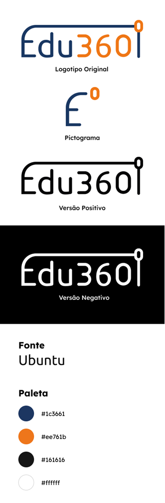
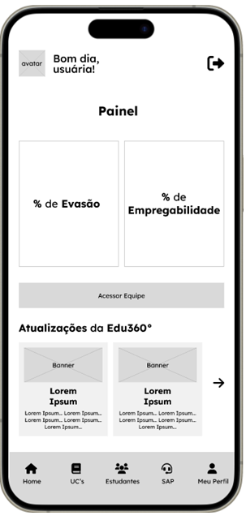
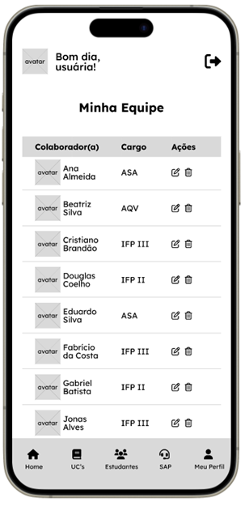

# Processo Seletivo: Técnico em programação - Mobile

## Informações:
- Linguagem: Flutter(Preferencialmente) / React Native 
- Tempo de prova: 1h30

## Demandas Gerais
1.	Todos os textos dos componentes devem ser exatamente iguais como são escritos nesta prova, exceto quando providos de APIs;
2.	O protótipo deve seguir os padrões de acessibilidade entre os textos e os fundos dos componentes;
3.	Todas as páginas devem ter melhorias no design;
4.	Você não precisa usar exatamente todos os recursos disponibilizados em media-files; 
5.	Você deve seguir a guia de estilos abaixo para desenvolver o aplicativo e suas funcionalidades:

## 01 - Tela Home

### Componentes Visuais
1.	Avatar para acionar a tela “Meu Perfil”;
2.	Texto “Bom-dia, usuária!”;
3.	Ícone de logout;
4.	Menu inferior com as opções:
“Home”, “UC’s”, “Estudantes”, “SAP” e “Meu Perfil”; 
5.	Título “Painel”;
6.	Card com Porcentagem de Evasão com o valor: 15%;
7.	Card com Porcentagem de Empregabilidade com o valor: 77%;
8.	Botão “Acessar Equipe”;
9.	Subtítulo “Atualizações da Edu360°”;
10.	Cards das atualizações conforme wireframe.

### Requisitos Funcionais
1.	A tela deve apresentar animação de entrada dos componentes visuais, essa animação deve ser encadeada e utilizar o princípio Slow In & Slow Out (Aceleração e Desaceleração);
2.	O carrossel deve ser funcional tanto ao dar um tap e arrastar para os lados quanto pelas setas;
3.	A tela deve apresentar animação de saída dos componentes visuais, essa animação deve ser encadeada e utilizar o princípio Slow In & Slow Out (Aceleração e Desaceleração);

## 02 - Tela Minha Equipe

### Componentes Visuais
1.	Avatar para acionar a tela “Meu Perfil”;
2.	Texto “Bom-dia, usuária!”;
3.	Ícone de logout;
4.	Menu inferior com as opções:
“Home”, “UC’s”, “Estudantes”, “SAP” e “Meu Perfil”; 
5.	Título “Minha Equipe”;
6.	Tabela com colunas e dados conforme wireframe.

### Requisitos Funcionais
1.	A tela deve apresentar animação de entrada
dos componentes visuais, essa animação deve ser encadeada
e utilizar o princípio Slow In & Slow Out (Aceleração e Desaceleração);
2.	A lista de colaboradores(as) deve ser exibida de forma alfabética;
3.	As informações referentes a equipe da coordenação devem ser
consumidas através da API fornecida em media-files; 
4.	A tela deve apresentar animação de saída
dos componentes visuais, essa animação deve ser encadeada
e utilizar o princípio Slow In & Slow Out (Aceleração e Desaceleração);

# Critérios de Avaliação
- Qualidade do código e estrutura de diretórios;
- Qualidade da implementação do Design;
- Acessibilidade;
- Tomadas de decisão;
- Comportamento mediante o desafio passado;

# Entrega
- Atente-se com a entrega, crie o repositório já no início da execução da prova;
- Encaminhar um email com o link do repositório **público** para: **paulo.brandao@sp.senai.br**, com cópia para: **oliver.silva@sp.senai.br**;
- Assunto: Processo Seletivo Mobile Jr.
- Mensagem contendo: nome completo;
